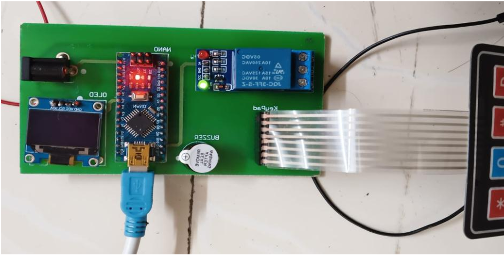
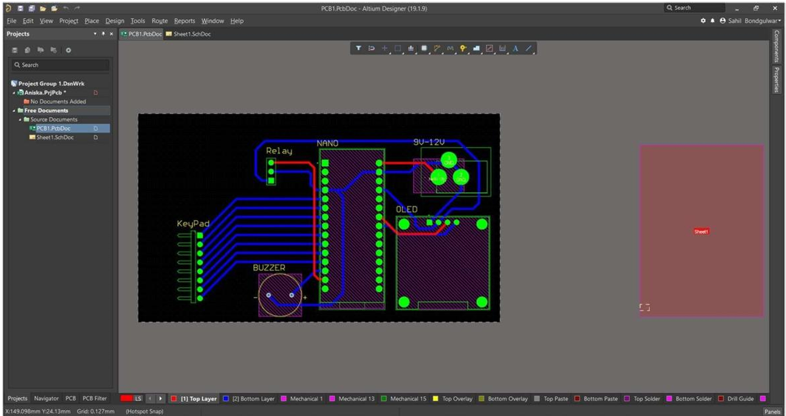
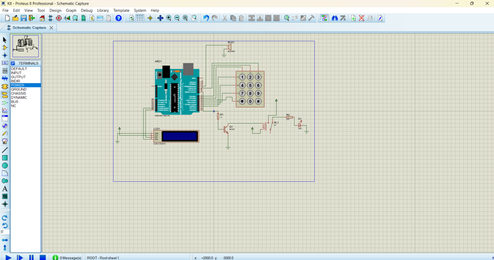

# 🔐 Solenoid Door Access Control

An Arduino Nano–based PIN authentication door lock. Enter your PIN on a 4×4 keypad — correct entries release a relay-driven solenoid, wrong entries get rejected and locked out after repeated tries.

## Quick Overview
- 4×4 keypad PIN entry with LCD feedback
- Fail-safe: stays locked by default
- Auto re-lock + brute-force lockout after failed attempts
- In-field PIN change, saved to EEPROM
- Custom 2-layer PCB (Gerbers included)

## Hardware
Arduino Nano · 4×4 keypad · 16×2 LCD · 12V solenoid · relay module · buzzer + LEDs

## Getting Started
1. Wire per the pin map (see full README) or use the included PCB
2. Flash `firmware/Solenoid_Door_Access_Control.ino` via Arduino IDE
3. Install libraries: `Keypad`, `LiquidCrystal`, `EEPROM`
4. Default PIN is `1234` — change it anytime with the `A` key

## Full Details
See the main [README](./README.md) for pin mapping, PCB drill report, repo structure, and design notes.

## License
Open-source — feel free to use, modify, and build on it.
